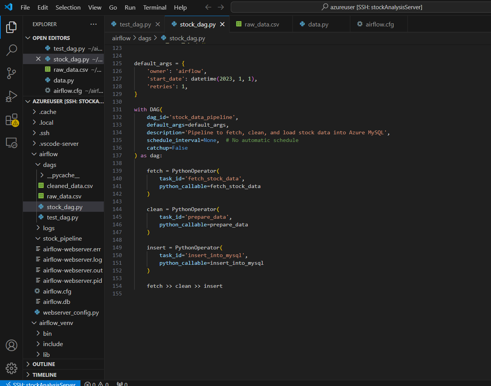
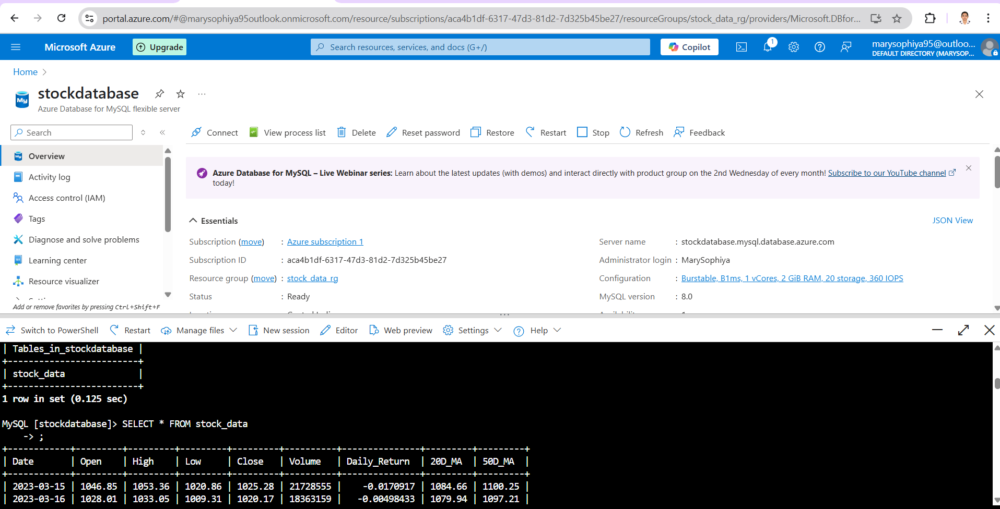

# Welcome to my Reliance stock analysis project!  
This project demonstrates an end-to-end **automated data pipeline**, integrating data fetching, transformation, cloud storage, automation, and visualization.

---

## 🚀 Project Overview

- **Objective:** Fetch, clean, store, and visualize Reliance stock market data.
- **Automation:** Built using **Apache Airflow** running on an Azure Virtual Machine (VM).
- **Cloud Storage:** Data stored in **Azure MySQL Database**.
- **Visualization:** Interactive dashboard created using **Power BI**.

---

## 🔧 Tech Stack

| Component        | Technology                            |
|------------------|---------------------------------------|
| Data Source      | [yfinance](https://pypi.org/project/yfinance/) Python Library |
| Data Processing  | Python (Pandas, NumPy)                |
| Orchestration    | Apache Airflow (Azure VM - B2s)       |
| Cloud Database   | Azure MySQL Server                   |
| Visualization    | Microsoft Power BI                   |
| Hosting          | Azure Virtual Machine (Ubuntu)       |

---

## 📚 Project Structure

```bash
reliance-stock-analysis/
├── dags/
│   └── reliance_stock_etl.py        # Airflow DAG for ETL
├── scripts/
│   ├── fetch_data.py                 # Fetch data from yfinance
│   ├── clean_transform_data.py       # Clean and transform data
│   └── load_to_mysql.py              # Load data into Azure MySQL
├── powerbi/
│   └── reliance_stock_report.pbix    # Power BI report file
├── README.md                         # Project Documentation
└── requirements.txt                  # Python Dependencies
```
---
## ⚙️ How It Works
- **Fetch Data -**
Fetch Reliance stock data using yfinance.

- **Data Cleaning and Transformation -**
Clean and transform the raw data using Python scripts.

- **Load to Azure MySQL -**
Store the cleaned data into an Azure-hosted MySQL database.

- **Automation using Airflow -**
Orchestrate the entire ETL process with Airflow DAGs (scheduled and automated).

- **Visualization with Power BI -**
Connect Power BI to Azure MySQL and build an interactive stock performance dashboard.

## 📅 Future Enhancements
- **Automate Power BI dataset refresh.**

- **Daily scheduling in Airflow for automatic updates.**

- **Add multi-stock support and new KPIs.**

## 🛠️ Setup Instructions
- **Clone the repository :**
git clone https://github.com/sophiyageorge/Reliance-Stock-Analysis-Pipeline.git

- **Configure Airflow :**
Set up a new DAG using reliance_stock_etl.py.

- **Add MySQL connection credentials in Airflow Admin UI :**

- **Set up Azure MySQL :**
Create a database and update the credentials in load_to_mysql.py.

- **Power BI Dashboard :**
Open reliance_stock_report.pbix in Power BI Desktop.

- **Connect to your Azure MySQL database.**


## 📸 Sample Outputs

<p align="center">
  
  &nbsp;&nbsp;&nbsp;
  
  &nbsp;&nbsp;&nbsp;
  
</p>

<p align="center">
  
  &nbsp;&nbsp;&nbsp;
  
  &nbsp;&nbsp;&nbsp;
  
</p>

<p align="center">
  
  &nbsp;&nbsp;&nbsp;
  
</p>

## ✨ Acknowledgments
- **yfinance Python library**

- **Apache Airflow**

- **Azure MySQL Database**

- **Microsoft Power BI**

## 📬 Connect With Me
Feel free to connect with me on LinkedIn for collaboration, discussions, or feedback!
## Mary Sophiya https://www.linkedin.com/in/mary-sophiya-145669131/

#️⃣ #DataScience #CloudComputing #ETL #Azure #Airflow #PowerBI #Python #Automation

